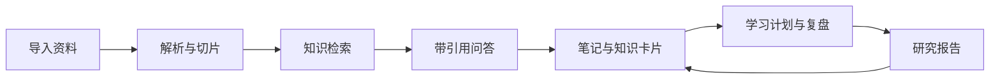
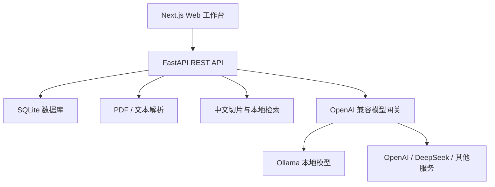

# MemoStudy Agent

> 将散落的文档和笔记转化为可检索、可问答、可复盘、可输出的个人知识系统。

[](./backend)
[](./frontend)
[](https://www.python.org/)
[](https://www.docker.com/)
[](https://github.com/yythlss/MemoStudy-Agent/actions/workflows/ci.yml)

MemoStudy Agent 是一个本地优先的个人知识管理与学习助手。用户可以导入自己的资料，围绕知识库进行带引用的问答，制定学习路径、跟踪任务、生成学习复盘，并将资料整理成结构化研究报告。

当前版本是一个可以实际运行的 MVP：不配置大语言模型时仍可进行资料解析、检索和引用；连接 Ollama 或其他 OpenAI 兼容模型后，可以获得完整的智能问答、复盘和报告生成能力。

## 核心能力

- **专题知识库**：按研究主题管理资料，支持独立检索范围。
- **多格式资料导入**：支持 PDF、TXT、Markdown、CSV、JSON、文本粘贴和文件夹批量导入。
- **本地知识检索**：自动清洗、切片和建立中文检索索引。
- **可信智能问答**：回答严格结合知识库上下文，并展示原文引用。
- **个人学习路径**：将学习目标自动拆分为五阶段可执行任务。
- **学习进度与复盘**：跟踪任务完成度，生成每日、每周或专题复盘。
- **研究报告工作室**：检索已有证据，生成带引用的 Markdown 报告。
- **知识笔记接口**：支持普通笔记、概念卡、问题卡、方法卡和闪卡。
- **模型自由选择**：兼容 Ollama、OpenAI、DeepSeek 及其他 OpenAI 格式接口。
- **本地数据控制**：默认使用 SQLite，资料和记录保存在自己的设备上。

## 产品闭环



## 界面模块

| 模块 | 用途 |
|---|---|
| 工作台 | 展示知识库、资料、笔记、报告和今日任务概览 |
| 资料库 | 创建专题知识库，上传文件或粘贴文本 |
| AI 研究 | 基于资料问答并查看每条引用证据 |
| 学习中心 | 创建学习目标、完成任务并生成学习周报 |
| 报告工作室 | 根据研究要求生成和管理 Markdown 报告 |

## 技术架构



| 层级 | 技术 |
|---|---|
| 前端 | Next.js 16、React 19、TypeScript、原生 CSS |
| 后端 | Python 3.10+、FastAPI、Pydantic |
| 数据 | SQLite，本地文档切片索引 |
| 文件解析 | pypdf、UTF-8/GB18030 文本解析 |
| 模型调用 | OpenAI-compatible `/v1/chat/completions` |
| 部署 | Docker Desktop、Docker Compose |
| 测试 | Pytest、TypeScript、Next.js Production Build |

## 快速开始

### Windows 一键启动

如果 Docker Desktop 安装在 `D:\app\docker\program`，可以直接双击项目根目录中的：

- `start-memostudy.cmd`：启动 Docker、项目服务并打开浏览器
- `stop-memostudy.cmd`：停止项目服务，保留知识库数据

本机安装时还可以直接双击桌面的“启动 MemoStudy Agent”。

### 方式一：Docker Compose（推荐）

安装 Docker Desktop 后执行：

```powershell
git clone https://github.com/yythlss/MemoStudy-Agent.git
cd MemoStudy-Agent
Copy-Item .env.example .env
docker compose up --build
```

服务启动后访问：

- Web 工作台：<http://localhost:3000>
- API 文档：<http://localhost:8000/docs>
- 健康检查：<http://localhost:8000/health>

如果 3000 或 8000 端口已被占用，可以在 `.env` 中修改 `FRONTEND_PORT` 和
`BACKEND_PORT`，例如将前端改为 `FRONTEND_PORT=3001`。

停止服务：

```powershell
docker compose down
```

SQLite 数据保存在 Docker 命名卷 `deepstudy_data` 中，普通的 `docker compose down` 不会删除它。

### 方式二：本地开发

#### 启动后端

```powershell
cd backend
python -m venv .venv
.\.venv\Scripts\Activate.ps1
pip install -r requirements.txt
uvicorn app.main:app --reload
```

后端首次启动会自动创建 `backend/data/deepstudy.db` 和默认知识库。

#### 启动前端

打开另一个终端：

```powershell
cd frontend
npm install
npm run dev
```

访问 <http://localhost:3000>。

## 配置大语言模型

复制配置文件：

```powershell
Copy-Item .env.example .env
```

### Ollama 示例

安装并下载中文模型：

```powershell
ollama pull qwen3:8b
```

Docker Compose 场景下，在 `.env` 中填写：

```dotenv
LLM_BASE_URL=http://host.docker.internal:11434/v1
LLM_MODEL=qwen3:8b
LLM_API_KEY=ollama
```

如果后端直接运行在 Windows，而不是 Docker 中：

```dotenv
LLM_BASE_URL=http://localhost:11434/v1
LLM_MODEL=qwen3:8b
LLM_API_KEY=ollama
```

### 云端兼容接口

```dotenv
LLM_BASE_URL=https://your-provider.example.com/v1
LLM_MODEL=your-model-name
LLM_API_KEY=your-api-key
```

系统不会把 API Key 写入数据库。请勿提交本地 `.env` 文件。

## API 概览

| 方法 | 地址 | 用途 |
|---|---|---|
| GET | `/health` | 服务健康检查 |
| GET | `/api/v1/dashboard` | 工作台统计和今日任务 |
| GET / POST | `/api/v1/collections` | 查询或创建专题知识库 |
| GET / POST | `/api/v1/sources` | 查询或导入文本资料 |
| POST | `/api/v1/sources/upload` | 上传并解析文件 |
| GET / POST | `/api/v1/notes` | 查询或创建笔记、知识卡片 |
| POST | `/api/v1/chat/query` | 知识库问答和引用检索 |
| GET / POST | `/api/v1/learning/goals` | 学习目标和自动任务路径 |
| PATCH | `/api/v1/learning/tasks/{id}` | 更新学习任务状态 |
| POST | `/api/v1/reviews/generate` | 生成学习复盘 |
| GET | `/api/v1/reports` | 查询历史研究报告 |
| POST | `/api/v1/reports/generate` | 生成研究报告 |

完整交互文档可在服务启动后访问 <http://localhost:8000/docs>。

## 项目结构

```text
MemoStudy-Agent/
├── .github/workflows/ci.yml   GitHub Actions 自动测试
├── backend/
│   ├── app/api/               REST API
│   ├── app/services/          文档、检索和模型服务
│   ├── tests/                 单元与端到端测试
│   └── Dockerfile
├── frontend/
│   ├── app/                   页面、布局和设计系统
│   ├── lib/                   API 客户端
│   └── Dockerfile
├── .env.example               环境变量模板
├── docker-compose.yml         本地一键部署
└── README.md
```

## 开发验证

后端：

```powershell
cd backend
.\.venv\Scripts\python.exe -m pytest -q
```

前端：

```powershell
cd frontend
npm run typecheck
npm run build
npm audit --audit-level=high
```

## 当前边界

这是项目的第一个 MVP，当前检索采用轻量本地实现，适合个人规模资料库。以下能力尚未完成：

- DOCX、PPTX、图片 OCR 和网页自动采集
- 向量 Embedding、混合检索与 Reranker
- 间隔重复、自动测验和完整知识卡片界面
- 双向链接和知识图谱可视化
- 流式输出和长任务队列
- Word、PDF、PPT 报告导出
- 多用户登录、权限和团队协作

## Roadmap

- [x] 资料库和文档导入
- [x] 文档切片与本地检索
- [x] 带引用知识问答
- [x] 学习目标和任务路径
- [x] 学习复盘
- [x] 研究报告生成
- [x] Docker Compose 部署
- [ ] pgvector 向量检索与重排序
- [ ] 知识卡片和间隔重复
- [ ] 网页、Word、PPT、OCR 导入
- [ ] 知识图谱
- [ ] 报告多格式导出
- [ ] 用户与团队空间

## 数据与隐私

- 默认数据库和资料处理均位于本地设备或自己的 Docker 卷中。
- 未配置模型时，应用不会向第三方模型服务发送知识库内容。
- 配置云端模型后，相关检索片段会发送给所配置的服务商，请根据数据敏感程度选择模型。
- `.env`、数据库文件、虚拟环境和构建产物已经加入 `.gitignore`。

## 参与开发

欢迎提交 Issue 和 Pull Request。提交前请确保：

1. 后端测试全部通过。
2. 前端 TypeScript 检查和生产构建通过。
3. 不提交 `.env`、API Key、数据库文件或个人资料。
4. 新增接口时同步更新 README 或 API 文档。
